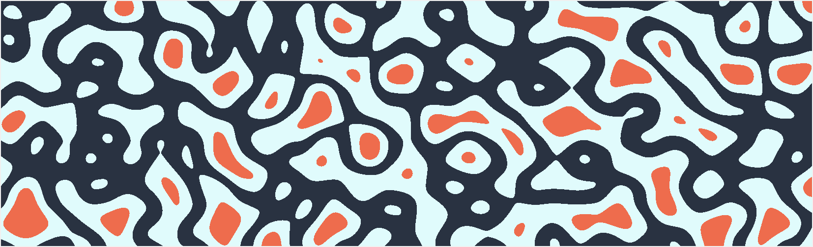

# Noise picture generator

This project originally started as a school project where the goal was to create an "[Oldskool Demo](https://en.wikipedia.org/wiki/Demo_effect)". The demo for the course was built using Scala, but for this project I decided to try using Python. Unfortunately Python is not quite as performant as Scala for this task, so I couldn't get a reasonably sized demo running smoothly. Thus, this project has become a picture generator that utilizes noise generators like Perlin noise.

My LinkedIn banner was created with this program and can be seen below

Even generating this image takes quite a while currently, but as this project is just a personal project, I won't be focusing on performance, but rather on new features.